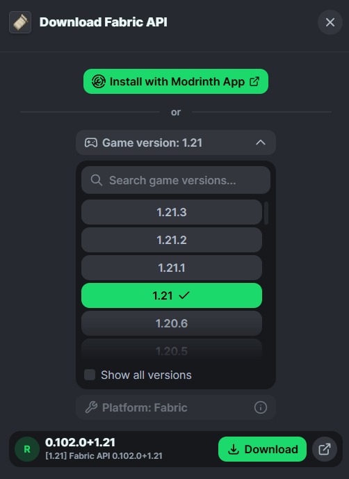

# Welcome to my Mods changer.

## Installation
First of all you need `python` which you can install in [this website](https://www.python.org/downloads/). After that you just follow the instructions, but make sure to tick "Add to PATH".

Then download this repo using [this link](https://github.com/iSimpp/MODS/archive/refs/heads/main.zip), unzip it and then follow the How To Use part.

## How to Use:
To add different Mod Folders, just run `python diradd.py <name of the folder>`, then go into your cmd, and execute addmods.py with the arguments being: `python addmods.py <link to the .jar file> <name you want it to save as>`

Then to change directories you should run `addversion.py` it will open a GUI and then you can select which Folder of Mod/s you want it to run.

# Visual Explaination:
We will be covering Modrinth and CurseForge.

## Modrinth
**Step 1**:

Go into https://modrinth.com/mods, and then click on your favourite mod. I'll be demostrating using Fabric API.

**Step 2**:
After you've clicked on your mod, click on the ***Download*** button:

And then select your version, mine is going to be 1.21, .

**Step 3**:

⚠️**Do not click the Download button.** Right click it and then just
.

**Step 4**:

Open File Explorer (Windows + E) and nagivate to the MODS folder (this one).

Right click it `Open in Terminal` and then run <code><pre>python addmods.py [link] [name of the mod]</pre></code>

In my case I would run:

<pre><code>python addmods.py <b>https://cdn.modrinth.com/data/P7dR8mSH/versions/oGwyXeEI/fabric-api-0.102.0%2B1.21.jar</b> FabricAPI`</code></pre>
